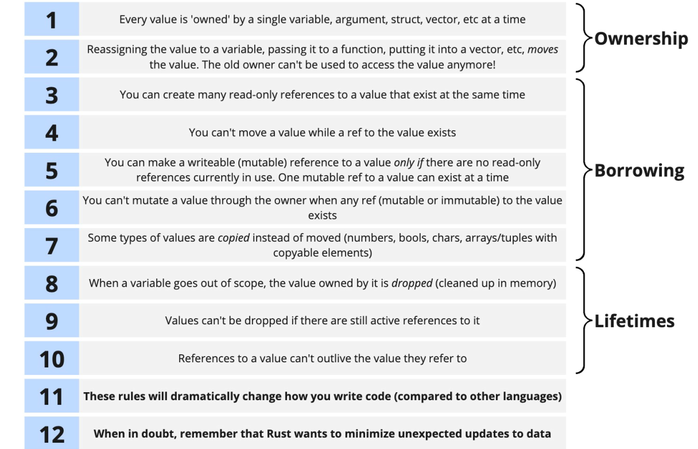

# rust-learning

## Rules of ownership, borrowing and lifetimes

## References

[[00] Rust: The Complete Developer's Guide - udemy.com](https://www.udemy.com/course/rust-the-complete-developers-guide/)
